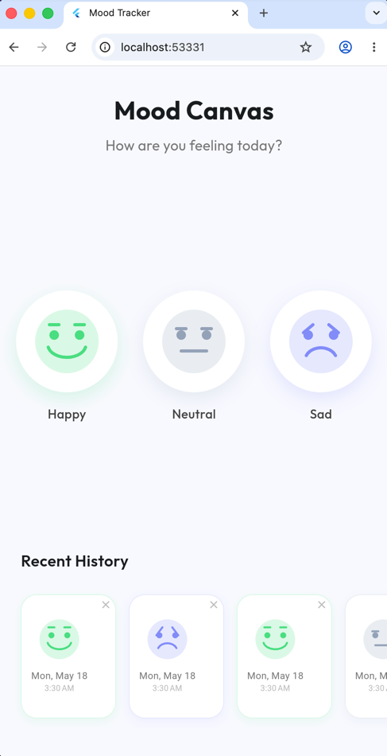

# Mood Tracker

A beautiful, intuitive mobile application that helps you track and understand your emotional well-being over time. Simply tap on how you're feeling each day - happy, neutral, or sad - and watch your mood journey unfold visually.

## What It Does

Mood Tracker transforms emotional awareness into a delightful daily habit. Rather than complicated journaling, it offers a simple, visual approach to emotional reflection:

- **Quick Daily Check-ins**: Log your mood in seconds with a tap
- **Beautiful Visualizations**: Each mood is represented with a friendly animated face
- **Personal Mood History**: See your emotional patterns over time
- **Privacy Focused**: All data stays on your device, never uploaded

## Features

- 🎨 **Visually Appealing Interface**: Clean, modern design with thoughtful animations
- 😊 **Three Mood States**: Easily capture your feelings as happy, neutral, or sad
- 📈 **Mood Timeline**: Scroll through your recent emotional journey
- 🔒 **Private & Secure**: Data stored locally on your device
- 🚀 **Lightning Fast**: Smooth performance with efficient state management

## Tech Stack

Built with Flutter and modern best practices:

- **Architecture**: Clean architecture with separation of concerns
- **State Management**: Flutter BLoC pattern for predictable state handling
- **Data Persistence**: SharedPreferences for lightweight local storage
- **UI Framework**: Flutter with custom animations and painters
- **Dependency Injection**: Service locator pattern for clean code organization

## Getting Started

1. Clone this repository
2. Run `flutter pub get` to install dependencies
3. Connect a device or start an emulator
4. Run `flutter run` to launch the app

## How It Works

Each day, simply open the app and tap on the mood face that best represents how you're feeling:
- **Happy** (green): Great day!
- **Neutral** (gray): Nothing special
- **Sad** (purple): Challenging day

Your mood entries are displayed in a timeline at the bottom of the screen, allowing you to reflect on your emotional journey over time.

## Screenshot
 